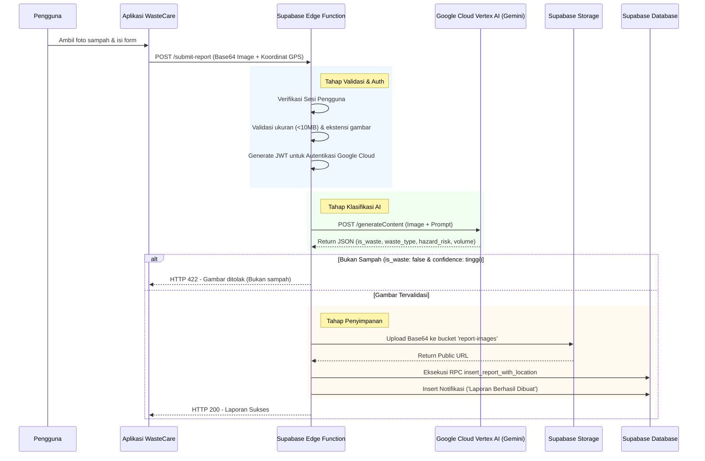

# Alur Integrasi Vertex AI (WasteCare)

Dokumen ini menjelaskan bagaimana arsitektur dan alur kerja (workflow) pengenalan sampah menggunakan Google Cloud Vertex AI (Gemini 2.5 Flash) yang diimplementasikan pada aplikasi WasteCare.

## 1. Arsitektur Umum

WasteCare menggunakan model kecerdasan buatan berbasis *vision* untuk memverifikasi dan mengklasifikasikan foto laporan secara otomatis. Logika AI ini diisolasi di dalam **Supabase Edge Function** (`submit-report`) demi keamanan kredensial dan performa.

## 2. Diagram Alur (Sequence Diagram)

Berikut adalah urutan proses ketika pengguna menekan tombol "Kirim Laporan":

## 3. Tahapan Proses Detail

### A. Pengiriman Data dari Pengguna (Frontend)
Saat pengguna melakukan submit, aplikasi mengirimkan request HTTP POST ke endpoint Supabase Edge Function `/functions/v1/submit-report`. Data yang dikirimkan meliputi:
- `image_base64`: Gambar dalam format base64.
- `latitude` & `longitude`: Koordinat lokasi pengguna.
- (Opsional) Kategori dan catatan manual dari pengguna jika mereka memilih untuk mengisi secara manual.

### B. Pembuatan Akses Token Vertex AI (Edge Function)
Agar dapat berkomunikasi dengan Google Cloud secara aman tanpa memaparkan kunci API di frontend, Edge Function menggunakan kredensial *Service Account* (`GOOGLE_SERVICE_ACCOUNT_JSON`).
1. Edge Function menandatangani JWT (*JSON Web Token*) secara lokal menggunakan kunci privat (RSA) dari Service Account.
2. Token tersebut ditukar (exchanged) dengan Google OAuth2 Server untuk mendapatkan `access_token` yang valid selama 1 jam.

### C. Proses Klasifikasi dengan Gemini 2.5 Flash
Edge Function menyatukan gambar base64 dengan *System Prompt* yang ketat dan mengirimkannya ke endpoint `gemini-2.5-flash` di Vertex AI (`us-central1`).

**Aturan Prompting (System Prompt):**
AI diinstruksikan untuk merespons **HANYA** dengan objek JSON murni. Skema yang diwajibkan adalah:
- `is_waste` (boolean): Apakah gambar benar-benar berisi tumpukan sampah?
- `confidence`: Tingkat keyakinan (tinggi/menengah/rendah).
- `waste_type`: Jenis sampah (organik/anorganik/campuran).
- `hazard_risk`: Tingkat bahaya (tidak_ada/rendah/menengah/tinggi).
- `waste_volume`: Estimasi volume. **(Telah dioptimasi untuk mendeteksi *scattered light plastics* di jalanan agar tidak keliru memprediksi volume besar).**
- `location_category`: Kategori lokasi tempat sampah berada.

### D. Parsing & Validasi Hasil AI
Setelah menerima respons JSON dari Vertex AI:
1. Kode melakukan ekstraksi dan *repair* JSON jika AI secara tidak sengaja menyelipkan teks tambahan.
2. Dilakukan pengecekan enum (*sanitization*). Jika AI mengembalikan nilai di luar kategori yang diizinkan, sistem mengubahnya menjadi nilai *default*.
3. **Pencegahan Penyalahgunaan:** Jika AI mendeteksi gambar tersebut bukan sampah (`is_waste: false`) dengan tingkat kepercayaan (`confidence`) `"tinggi"`, proses langsung dihentikan.

### E. Penyimpanan & Notifikasi
Jika gambar lolos verifikasi AI:
1. Gambar diubah menjadi *buffer* dan diunggah ke Supabase Storage (`report-images`).
2. Edge Function memanggil fungsi database SQL (*RPC*) `insert_report_with_location` untuk menyimpan data pelapor, koordinat GPS (sebagai tipe *PostGIS POINT*), dan hasil klasifikasi.
3. Sebuah entri baru ditambahkan ke tabel `notifications`, memicu notifikasi masuk di aplikasi pengguna.
4. Edge Function mengembalikan respons sukses ke Frontend.

## 4. Rencana Pengembangan (Proyek Profesional)

Untuk meningkatkan akurasi dan skalabilitas sistem pada level produksi/profesional, berikut adalah beberapa strategi pengembangan yang dapat diimplementasikan:

### A. Estimasi Berat Sampah yang Lebih Akurat
Mengestimasi berat (kg) murni dari foto 2D sangatlah sulit karena AI tidak bisa melihat kepadatan (massa jenis) suatu material.
**Rencana Solusi:**
- **Peningkatan Prompt (Interim):** Menambahkan *Visual Anchors* pada prompt seperti yang telah dilakukan saat ini (membedakan *"scattered light plastics"* dengan sampah padat) untuk mencegah bias luas permukaan.
- **AI Estimasi Volume + Material:** Melatih model spesifik untuk fokus mengestimasi **volume dimensi 3D** dan **jenis material**, kemudian mengalikannya dengan rata-rata massa jenis material tersebut.
- **Human-in-the-Loop:** Berikan estimasi rentang (contoh: 5kg - 20kg) oleh AI, namun tetap berikan fitur input manual bagi petugas untuk memasukkan berat presisi (terutama jika terintegrasi timbangan IoT).

### B. Pengayaan Konteks Bahaya (Hazard Risk) via Geolocation API
Saat ini AI hanya melihat gambar. Jika sampah medis berada di dekat rumah sakit, risiko bahayanya jauh lebih tinggi, namun AI tidak tahu lokasinya.
**Rencana Solusi:**
- **Reverse Geocoding / Google Places API:** Sebelum mengirim data ke Vertex AI, Edge Function memanggil API Maps menggunakan `latitude` dan `longitude` pelapor untuk mendeteksi landmark terdekat.
- **Contextual Prompting:** Sistem menyuntikkan data tersebut ke dalam prompt AI. (Contoh prompt: *"Perhatian: Sampah ini berlokasi 50 meter dari Rumah Sakit Umum. Evaluasi hazard_risk dengan lebih ketat."*)

### C. Self-Correction & Multi-Agent Validation
Untuk meminimalisir halusinasi atau kesalahan klasifikasi awal dari model vision tunggal.
**Rencana Solusi:**
- Terapkan alur **Multi-Step Verification**: 
  1. *Model 1 (Vision Fast)*: Ekstraksi fitur dasar dari gambar.
  2. *Model 2 (Reasoning/Pro)*: Menerima output JSON dari Model 1, konteks lokasi (sekolah/RS), dan gambar aslinya, lalu memverifikasi ulang apakah klasifikasi `hazard_risk` dan `waste_type` sudah sangat tepat dan logis.
